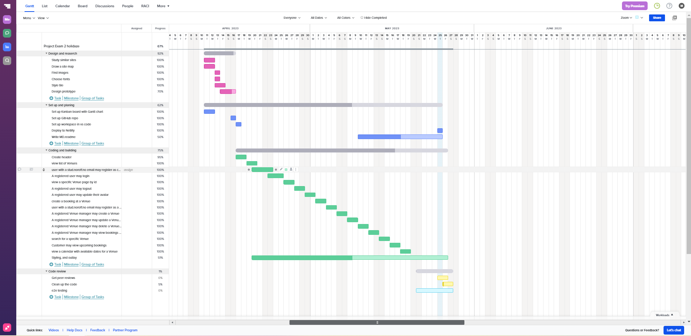

# Holidaze Accommodation Booking Site

Holidaze is a modern, user-friendly accommodation booking site that connects users with their ideal holiday venues. With a sleek front end design, Holidaze offers seamless navigation and functionality, ensuring an enjoyable booking experience. The platform also includes an admin-facing side where registered users can manage venues and bookings efficiently.
   
Use a stud.noroff.no e-mail adress to register a new user. 

## Features

Here are some of the main features that Holidaze provides:

- View a list of venues.
- Search functionality to find specific venues.
- Detailed pages for each venue.
- A calendar with available dates for each venue.
- User registration for customers and venue managers.
- Booking creation and management for registered customers.
- Venue creation, update, and management for registered venue managers.
- Ability to view bookings for the venues a manager oversees.
- User login and logout functionality.
- Avatar update for registered users.

## Technical Information

Holidaze is developed using approved, modern technologies, ensuring robust performance and scalability. The application is built on the React JavaScript framework, coupled with a CSS framework for responsive and appealing design. It uses the Holidaze API for all functionalities, making it a front-end application only.

The application is hosted on Netlify, a popular static host known for its reliability and speed.

## Design and Planning Tools

For designing the user interface and user experience, i used Adobe XD

Our project planning was carried out using Trello, a web-based Kanban-style list-making application. We used a Gantt chart for project timing.

Gantt chart: 

## Links

- [Design Prototype](https://xd.adobe.com/view/4e827619-cf92-4caf-9325-8d3966f16553-1bd1/)
- [Kanban Project Board](https://trello.com/b/HckjTeWV/project-exam-2-holidaze)
- [Repository Link](https://github.com/martinMr79/project-exam2-martin-mroz)
- [Hosted Application Demo Link](https://master--fantastic-puppy-a523c3.netlify.app/)

## Installation

1. Clone the repository: `git clone <repository-link>`
2. Install the dependencies: `npm install`
3. Start the application: `npm start`

Please note that you need Node.js installed on your machine to run this application locally.

## Contribution

If you want to contribute, please fork the repository and use a feature branch. Pull requests are warmly welcome, but will not be accepted untill the project have been graded. 

## Licensing

The code in this project is licensed under MIT license.

---

For any additional information, please reach out.

## Available Scripts and Dependencies

This project was bootstrapped with [Create React App](https://github.com/facebook/create-react-app), so it comes with several scripts predefined in the package.json file. 

In the project directory, you can run:

### `npm start`

Runs the app in the development mode. Open [http://localhost:3000](http://localhost:3000) to view it in your browser.

### `npm test`

Launches the test runner in the interactive watch mode. See the section about [running tests](https://facebook.github.io/create-react-app/docs/running-tests) for more information.

### `npm run build`

Builds the app for production to the `build` folder. The build is minified, and the filenames include the hashes. Your app is ready to be deployed!

### `npm run eject`

**Note: this is a one-way operation. Once you `eject`, you can't go back!**

For advanced configuration and control over the project setup, you can use this command. But remember, once you eject, there's no going back!

## Dependencies

This project uses several dependencies for its functionality:

- [React Router DOM](https://reactrouter.com/) - for handling routing: `npm install react-router-dom`
- [Material UI](https://mui.com/) - for UI components: `npm install @mui/material @emotion/react @emotion/styled`
- [Zustand](https://www.npmjs.com/package/zustand) - for state management: `npm install zustand`
- [jwt-decode](https://www.npmjs.com/package/jwt-decode) - for decoding JWT tokens: `npm install jwt-decode`
- [React Date Picker](https://www.npmjs.com/package/react-datepicker) - for date selection functionality: `npm install react-date-picker`
- [Axios](https://www.npmjs.com/package/axios) - for making HTTP requests: `npm install axios`
- [Styled Components](https://www.npmjs.com/package/styled-components) - for styling components: `npm install styled-components`
- [React Swipeable Views](https://react-swipeable-views.com/) - for mobile-friendly view swiping: `npm install react-swipeable-views`
- [React Swipeable Views Utils](https://www.npmjs.com/package/react-swipeable-views-utils) - additional utilities for react-swipeable-views: `npm install react-swipeable-views-utils`
- [React Responsive Carousel](https://www.npmjs.com/package/react-responsive-carousel) - for creating responsive carousels: `npm install react-responsive-carousel`
